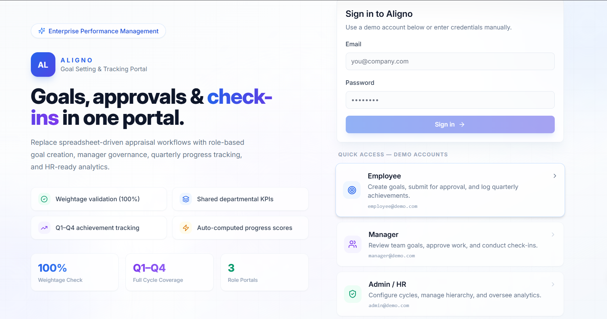
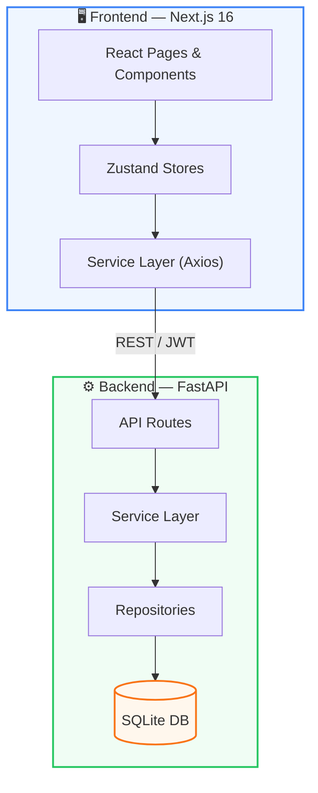
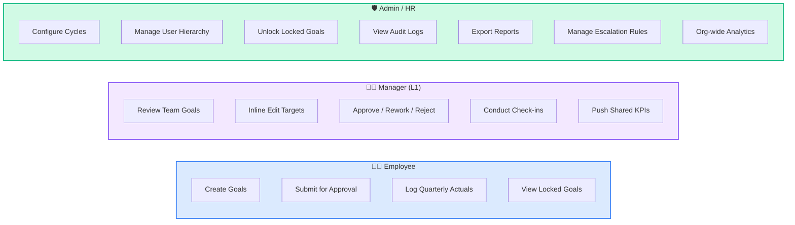
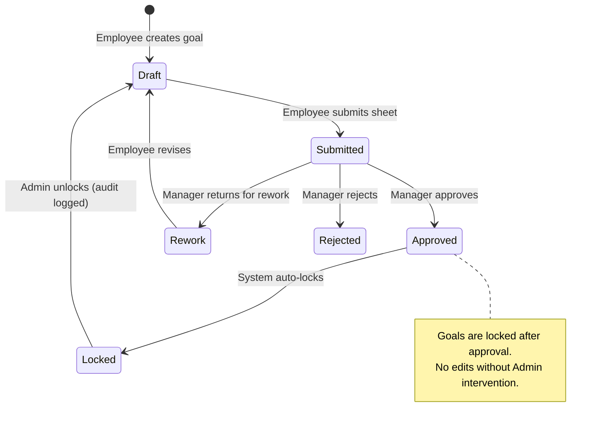
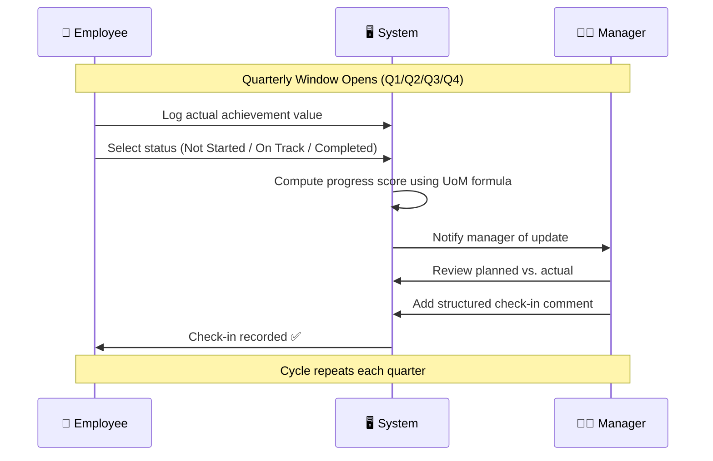
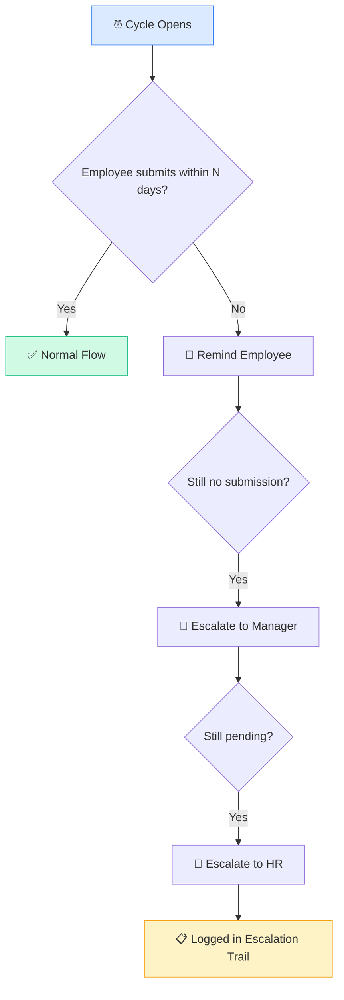

<p align="center">
  
  
  
  
  
</p>

<h1 align="center">🎯 Aligno — Performance Management Portal</h1>

<p align="center">
  <strong>Enterprise-grade goal setting, approvals, quarterly check-ins, and analytics.</strong><br/>
  <em>One portal for Employees · Managers · HR Admins</em>
</p>


<p align="center">
  
</p>

<p align="center">
  <a href="#-quick-start">Quick Start</a> ·
  <a href="#-features">Features</a> ·
  <a href="#-architecture">Architecture</a> ·
  <a href="#-user-roles--workflows">Workflows</a> ·
  <a href="#-api-reference">API Reference</a>
</p>

---

## ✨ Features

### Phase 1 — Goal Creation & Approval ✅
| Feature | Status |
|---------|--------|
| Employee goal sheet with Thrust Area, UoM (Numeric, %, Timeline, Zero-based), Targets & Weightage | ✅ |
| System-enforced validation: total weightage = 100%, min 10% per goal, max 8 goals | ✅ |
| Manager (L1) approval workflow with inline editing of targets / weightages | ✅ |
| Return for rework or reject with mandatory manager comments | ✅ |
| Approved goals lock automatically — no edits without Admin unlock | ✅ |
| Shared Goals: Admin/Manager push departmental KPIs to multiple employees | ✅ |

### Phase 2 — Achievement Tracking & Quarterly Check-ins ✅
| Feature | Status |
|---------|--------|
| Quarterly update interface for employees (Q1–Q4) | ✅ |
| Status per goal: Not Started / On Track / Completed | ✅ |
| Manager Check-in module with structured comments | ✅ |
| System-computed progress scores (Min, Max, Timeline, Zero-based formulas) | ✅ |

### Governance & Reporting ✅
| Feature | Status |
|---------|--------|
| Achievement Reports — exportable as CSV / Excel | ✅ |
| Completion Dashboard — real-time check-in completion rates | ✅ |
| Audit Trail — all post-lock goal changes logged (who, what, when) | ✅ |

### Bonus Features ✅
| Feature | Status |
|---------|--------|
| Cycle Management — configurable goal-setting and check-in windows | ✅ |
| User & Hierarchy Management — role assignment, manager mapping | ✅ |
| Goal Unlock Tool — admin can unlock approved goals with reason + audit | ✅ |
| Escalation Module — configurable rules, thresholds, and escalation chains | ✅ |
| Analytics Dashboard — QoQ trends, heatmaps, goal distribution, manager effectiveness | ✅ |

---

## 🏗 Architecture

### System Overview



### Tech Stack

| Layer | Technology | Purpose |
|-------|-----------|---------|
| **Frontend** | Next.js 16, TypeScript, Tailwind CSS | App Router, SSR, responsive UI |
| **State** | Zustand | Lightweight, modular stores |
| **UI Library** | Radix UI + Lucide Icons | Accessible components + icon set |
| **Charts** | Custom SVG components | Lightweight, zero-dependency |
| **Backend** | FastAPI, SQLAlchemy 2.0 (async) | REST API with async ORM |
| **Auth** | JWT (Bearer tokens) | Stateless authentication |
| **Database** | SQLite (aiosqlite) | Local-first, zero-config |
| **Migrations** | Alembic | Schema version control |

### Folder Structure

```
Aligno/
├── frontend/
│   └── src/
│       ├── app/                    # Next.js routes & layouts
│       │   ├── login/              # Auth login page
│       │   ├── dashboard/          # Employee dashboard & analytics
│       │   │   ├── goals/          # Goal sheet creation & editing
│       │   │   ├── checkins/       # Quarterly achievement entry
│       │   │   ├── manager/        # Manager review & team check-ins
│       │   │   └── admin/          # Admin portal
│       │   │       ├── audit/      # Audit log viewer
│       │   │       ├── cycles/     # Cycle management
│       │   │       ├── users/      # User & hierarchy management
│       │   │       ├── unlock/     # Goal unlock tool
│       │   │       ├── reports/    # CSV / Excel export
│       │   │       ├── escalations/# Escalation rules & logs
│       │   │       └── analytics/  # Deep-dive analytics
│       │   ├── employee/           # Employee entry redirect
│       │   ├── manager/            # Manager entry redirect
│       │   └── admin/              # Admin entry redirect
│       ├── components/
│       │   ├── analytics/          # KPI cards, charts, heatmaps
│       │   ├── checkins/           # Achievement tables, review dialogs
│       │   ├── layout/             # Navbar, Sidebar, DashboardShell
│       │   ├── manager/            # Goal review table & dialog
│       │   └── ui/                 # Reusable UI primitives (Radix-based)
│       ├── services/               # API service clients
│       ├── store/                  # Zustand state stores
│       ├── styles/                 # Global CSS & design tokens
│       └── types/                  # TypeScript type definitions
│
├── backend/
│   └── app/
│       ├── api/v1/                 # API routes (auth, goals, manager, etc.)
│       ├── core/                   # Config, security, JWT
│       ├── db/                     # Async session & base model
│       ├── models/                 # SQLAlchemy ORM models
│       ├── repositories/           # Database query layer
│       ├── schemas/                # Pydantic request/response DTOs
│       ├── services/               # Business logic layer
│       └── utils/                  # Seed data & helpers
│
├── .env.example
├── package.json                    # Monorepo workspace config
└── README.md
```

---

## 👥 User Roles & Workflows

### Role Capabilities



### Goal Lifecycle Workflow



### Quarterly Check-in Flow



### Escalation Flow



### Score Calculation Formulas

| UoM Type | Description | Formula | Example |
|----------|-------------|---------|---------|
| **Min (Numeric / %)** | Higher is better | `Achievement ÷ Target` | Sales Revenue |
| **Max (Numeric / %)** | Lower is better | `Target ÷ Achievement` | TAT, Cost |
| **Timeline** | Date-based completion | `Completion date vs. Deadline` | Project Deadline |
| **Zero-based** | Zero = Success | `If 0 → 100%, else 0%` | Safety Incidents |

---

## 🚀 Quick Start

### Prerequisites

- **Node.js** ≥ 18
- **Python** ≥ 3.11
- **Git**

### 1. Clone & Install

```bash
git clone <repository-url>
cd GoalSync

# Frontend
npm install

# Backend
cd backend
python -m venv .venv
.venv\Scripts\activate        # Windows
# source .venv/bin/activate   # macOS/Linux
pip install -r requirements.txt
```

### 2. Configure Environment

```bash
copy .env.example .env
copy frontend\.env.example frontend\.env.local
```

Default values work out-of-the-box for local development:

| Variable | Default Value |
|----------|--------------|
| `NEXT_PUBLIC_API_URL` | `http://localhost:8000/api/v1` |
| `DATABASE_URL` | `sqlite+aiosqlite:///./goalsync.db` |
| `JWT_SECRET_KEY` | `change-me-in-production` |

### 3. Setup Database

```bash
cd backend
alembic upgrade head
python -m app.utils.seed_demo
```

### 4. Start Servers

```bash
# Terminal 1 — Backend
cd backend
uvicorn app.main:app --reload

# Terminal 2 — Frontend
npm run dev
```

### 5. Open in Browser

| URL | Purpose |
|-----|---------|
| `http://localhost:3000` | Aligno Portal |
| `http://localhost:8000/docs` | Swagger API Docs |

### Demo Accounts

| Role | Email | Password |
|------|-------|----------|
| 🧑‍💼 Employee | `employee@demo.com` | `Employee123` |
| 👩‍💼 Manager | `manager@demo.com` | `Manager123` |
| 🛡️ Admin | `admin@demo.com` | `Admin123` |

---

## 📡 API Reference

### Authentication
| Method | Endpoint | Description |
|--------|----------|-------------|
| `POST` | `/api/v1/auth/register` | Register new user |
| `POST` | `/api/v1/auth/login` | Login → JWT tokens |
| `GET` | `/api/v1/auth/me` | Current user profile |

### Goals
| Method | Endpoint | Description |
|--------|----------|-------------|
| `POST` | `/api/v1/goals` | Create a new goal |
| `GET` | `/api/v1/goals` | List my goals |
| `PATCH` | `/api/v1/goals/{id}` | Update a goal |
| `DELETE` | `/api/v1/goals/{id}` | Delete a draft goal |

### Manager Review
| Method | Endpoint | Description |
|--------|----------|-------------|
| `GET` | `/api/v1/manager/goals` | All team goals |
| `GET` | `/api/v1/manager/goals/{employee_id}` | Goals for specific employee |
| `POST` | `/api/v1/manager/goals/{id}/approve` | Approve → lock goal |
| `POST` | `/api/v1/manager/goals/{id}/rework` | Return for rework |
| `POST` | `/api/v1/manager/goals/{id}/reject` | Reject goal |

### Check-ins & Achievements
| Method | Endpoint | Description |
|--------|----------|-------------|
| `GET` | `/api/v1/achievements` | My achievements |
| `POST` | `/api/v1/achievements` | Submit quarterly update |
| `PUT` | `/api/v1/achievements/{id}` | Edit achievement |
| `GET` | `/api/v1/checkins/team` | Team progress (manager) |
| `POST` | `/api/v1/checkins/{id}` | Add check-in comment |

### Analytics & Reports
| Method | Endpoint | Description |
|--------|----------|-------------|
| `GET` | `/api/v1/analytics/me` | My performance analytics |
| `GET` | `/api/v1/analytics/team` | Team analytics (manager) |
| `GET` | `/api/v1/analytics/org` | Org-wide analytics (admin) |
| `GET` | `/api/v1/reports/export?format=csv` | Export report as CSV |
| `GET` | `/api/v1/reports/export?format=xlsx` | Export report as Excel |

### Admin
| Method | Endpoint | Description |
|--------|----------|-------------|
| `GET` | `/api/v1/admin/users` | List all users |
| `PATCH` | `/api/v1/admin/users/{id}` | Update user role/manager |
| `GET` | `/api/v1/admin/audit-logs` | View audit trail |
| `GET` | `/api/v1/admin/locked-goals` | List locked goals |
| `POST` | `/api/v1/admin/goals/{id}/unlock` | Unlock a goal |
| `GET` | `/api/v1/admin/cycles` | Get cycle config |
| `PATCH` | `/api/v1/admin/cycles/{id}` | Update cycle dates/status |
| `GET` | `/api/v1/admin/escalation-rules` | List escalation rules |
| `PATCH` | `/api/v1/admin/escalation-rules/{id}` | Update rule threshold |
| `GET` | `/api/v1/admin/escalation-logs` | View escalation log |

---

## 🔧 Development Commands

```bash
# Frontend
npm run dev                          # Dev server (port 3000)
npm run build                        # Production build
npm run lint --workspace frontend    # ESLint
npm run typecheck --workspace frontend # TypeScript check

# Backend
uvicorn app.main:app --reload        # Dev server (port 8000)
alembic upgrade head                 # Run migrations
python -m app.utils.seed_demo        # Seed demo data
python -m compileall backend\app     # Syntax check
```

---

## 🔒 Validation Rules

The system enforces the following business rules at both UI and API levels:

- ✅ **Total weightage** across all goals must equal **100%**
- ✅ **Minimum weightage** per individual goal: **10%**
- ✅ **Maximum goals** per employee: **8**
- ✅ Approved goals are **automatically locked** — no further edits without Admin unlock
- ✅ Manager comment is **mandatory** for rework and rejection actions
- ✅ Locked goals cannot be updated or deleted via API

---

## 📝 Check-in Schedule

| Period | Window Opens | Action |
|--------|-------------|--------|
| **Phase 1 — Goal Setting** | 1st May | Goal Creation, Submission & Approval |
| **Q1 Check-in** | July | Progress Update — Planned vs. Actual |
| **Q2 Check-in** | October | Progress Update — Planned vs. Actual |
| **Q3 Check-in** | January | Progress Update — Planned vs. Actual |
| **Q4 / Annual** | March / April | Final Achievement Capture |

---

## 📄 License

This project was built for a performance management hackathon. All rights reserved.
